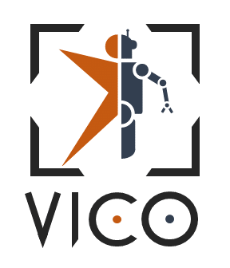

    

-----------------

### Open-VICO: An Open-Source Gazebo Toolkit for Multi-Vision-based Skeleton Tracking in Human-Robot Collaboration.

Reach the official Repo [here](https://gitlab.iit.it/hrii-public/open-vico)!

    
     
    <!-- caption -->

## Citation
Please cite [this]() paper in your publications if Open-VICO helps your research.

    @article{
      
    }